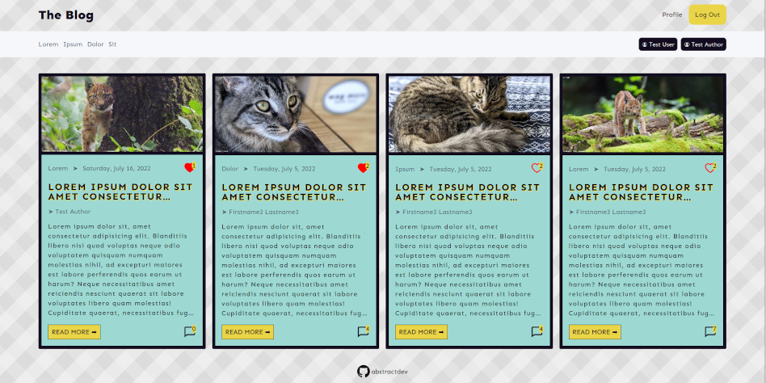

# The Blog

# 

[Live Demo](https://abstractdev.github.io/the-blog/) 
The front-end for my full stack blog. Built with TypeScript/React/SASS

---

## Features

- Mobile responsive
- User signup/Login
- User only features
  - Blogpost likes/Comment likes
  - Blogpost like history with link
  - Comment history with date
  - Comment like history with username
  - Blogpost like/unlike toggle state
- Author signup/Login
- Author only features
  - Authored blogposts view
  - Blogpost CRUD operations
  - Blogpost publish/unpublish
  - Blogpost category create/delete
- Test User and Author accounts
- Blogposts sortable by category
- Comments counter
- Comment likes/blogpost likes counter
- Anonymous comments
- Front-end form validation

## Built With

- Typescript
- SASS
- Iconify Icons
- React Router

## Concepts / Things I learned

- Using scss modules
- SASS mixins/partials
- Media query custom hook implementation
- Context API
- Protecting front-end routes

---
